# 2.3.4.4b-H5N1-analysis :duck: 🪿 
This repository contains the code and workflows used to reproduce results from the study:  
**“Avian influenza NA stalk length and HA glycosylation patterns reveal molecularly directed reassortment and emergence of highly pathogenic 2.3.4.4b H5N1.”**

It provides transparent, reproducible scripts to analyze **neuraminidase (NA) stalk length** and **hemagglutinin (HA) N-linked glycosylation sites**, and to visualize their combinatorial distributions across hosts and clades.

```mermaid
graph TD
    A["Input FASTA files<br/>(HA.fasta & NA.fasta)"] --> B["avian_na_ha_pipeline.py"]
    B -->|na subcommand| C["Compute NA stalk length<br/>(regex-defined region)"]
    B -->|ha subcommand| D["Count HA glycosylation motifs<br/>(N-X-[S/T], X≠P)"]
    C --> E["Merge HA–NA by EPI_ISL ID"]
    D --> E
    E --> F["Frequency table<br/>(Stalk_length × #GLS)"]
    F --> G1["Bubble plot<br/>(viz_bubbleplot.py)"]
    F --> G2["3D KDE ridges<br/>(viz_kde3d.py)"]
    G1 --> H["Figures for paper"]
    G2 --> H

```


<details>
<summary><b>🧭 Project Overview (click to expand)</b></summary>


</details>

## Table of Contents
- [Quick Start](#quick-start)
- [NA stalk length analysis](#na-stalk-length-analysis)
- [HA glycosylation analysis](#ha-glycosylation-analysis)
- [Bubble plot visualization](#bubble-plot-visualization)
- [3D KDE ridge visualization](#3d-kde-ridge-visualization)
- [Reproducibility notes](#reproducibility-notes)
- [Citation](#citation)

## Quick Start

### Clone and set up dependencies

```bash
git clone https://github.com/ranjanaanataraj/2.3.4.4b-H5N1-analysis.git
cd 2.3.4.4b-H5N1-analysis
python -m venv .venv && source .venv/bin/activate
pip install -U pip && pip install 
```

### Run the complete toy example

```bash
make example
```

### Or manually, step-by-step
```bash
# 1. Compute NA stalk lengths
python avian_na_ha_pipeline.py na \
  --fasta example_data/NA_aligned.fasta \
  --begin-regex 'G-?N-?I-?I-?S-?.-?.' \
  --end-regex   'V-?.-?.-?.-?T-?L' \
  --drop-first \
  --out out_na.csv

# 2. Count HA glycosylation motifs
python avian_na_ha_pipeline.py ha \
  --fasta example_data/H5_aligned.fasta \
  --out out_ha.csv

# 3. Merge & summarize
python avian_na_ha_pipeline.py merge \
  --ha out_ha.csv --na out_na.csv \
  --out out_merged.csv --counts out_counts.csv

# 4. Visualize as bubble plot
python viz_bubbleplot.py \
  --csv example_data/H5Nx_1990_bubble_plot.csv \
  --out docs/H5_bubble.png

# 5. Visualize in 3D (KDE ridges)
python viz_kde3d.py \
  --csv example_data/gls_demo.csv \
  --xcol GLS_count --gcol Group \
  --xmin 3 --xmax 11 --bw 0.4 \
  --elev 8 --azim -80 \
  --out docs/gls_kde3d.png
```
## NA stalk length analysis

### Workflow

<div align="center">
  

</div>


**Pipeline summary**

1. **Generate an N1 consensus sequence**  
   Use `EMBOSS cons` to create a consensus from your aligned N1 sequences.  

    ```bash
    # Example: Generate consensus sequence from aligned N1 FASTA
    cons \
      -sequence N1_aligned.fasta \
      -outseq N1_consensus.fasta \
      -name N1_consensus \
      -plurality 1 \
      -identity 0.0 \
      -setcase 0
    ```

2. **Align the consensus to a domain-demarcated reference**  
   Use `Clustal Omega` to align your new consensus with a reference N1 sequence that has annotated domains (TM, stalk, head).  

    ```bash
    clustalo \
      -i reference_N1.fasta,N1_consensus.fasta \
      -o N1_consensus_aligned.fasta \
      --force --auto --threads=4
    ```

3. **Align all N1 sequences to the annotated consensus**  
   Use the annotated consensus as a guide for aligning the full N1 dataset.

   ```bash
   clustalo \
    -i N1_dataset.fasta,N1_consensus_aligned.fasta \
    -o N1_full_aligned.fasta \
    --force --auto --threads=8
   ```
      Output: N1_full_aligned.fasta — all sequences aligned to a reference with known TM–stalk–head regions.


4. **Identify stalk boundaries using regular expressions**  
   Use the patterns defined in your script:  

   ```python
   stalk_begin_regex = 'G-?N-?I-?I-?S-?.-?.'
   stalk_end_regex   = 'V-?.-?.-?.-?T-?L'
   ````

   These delimit the stalk region in the consensus alignment.

6. **Compute stalk lengths**

   Run:
   ```bash
     python avian_na_ha_pipeline.py na \
      --fasta N1_full_aligned.fasta \
      --begin-regex 'G-?N-?I-?I-?S-?.-?.' \
      --end-regex   'V-?.-?.-?.-?T-?L' \
      --drop-first \
      --out na_stalk_lengths.csv
   ```
   
   This extracts stalk regions and computes their lengths (excluding alignment gaps)
   
📄 **Output:**

- `N1_consensus.fasta` — consensus sequence for domain mapping  
- `N1_consensus_aligned.fasta` — consensus aligned to domain reference  
- `N1_full_aligned.fasta` — dataset aligned to consensus  
- `na_stalk_lengths.csv` — computed stalk lengths per sequence

**Example output (`na_stalk_lengths.csv`):**

| EPI_ISL_ID | Date       | Stalk_length |
| :-----------: | :----------: | :-------------: |
| 1111111     | 2021-06-15 | 33            |
| 2222222     | 2022-03-20 | 53            |


## HA glycosylation analysis

### Workflow

**Pipeline summary**

1. Align all HA (H5) sequences from the same isolates used in the NA dataset.

2. Parse each header to extract `EPI_ISL_*` and date.

3. Scan each sequence for N-X-[S/T] motifs (X ≠ P).

4. Count valid N-linked glycosylation (GLS) motifs per sequence.

5. Export counts and merge with the NA dataset.

### Identifying N-linked glycosylation motifs

The canonical N-linked glycosylation consensus is:

```text
N-X-[S/T]
```
where X ≠ P

Detected using:
```python
[Nn][^Pp][SsTt]
```

Gaps (-) are removed before scanning.

<details> <summary>Notes on motif scanning</summary>

- Gaps introduced by alignment are ignored.

- Case-insensitive pattern matching.

- Partial motifs at sequence ends are excluded.

- Optional downstream filtering by site conservation.

</details>

### Output
| EPI_ISL_ID | Date       | GLS_count |
| ----------- | ---------- | ------------- |
| 1111111     | 2021-06-15 | 7            |
| 2222222     | 2022-03-20 | 6            |


## Bubble plot visualization (H5 #GLS × NA stalk length)

This figure visualizes H5 glycosylation-site counts versus NA subtype/stalk length. Each bubble’s size ∝ frequency and color ∝ stalk length.
Script: `viz_bubbleplot.py`
Input: CSV with `#GLS`, `NA`, `Stalk_length`, `Frequency`.

### Quick run
```bash
python viz_bubbleplot.py \
  --csv example_data/H5Nx_1990_bubble_plot.csv \
  --out docs/H5_bubble.png
```
Output → docs/H5_bubble.png (PNG or PDF)

### Example input
| #GLS | NA | Stalk_length | Frequency |
| :--: | :--: | :----------: | :--------: |
| 7 | N1 | 33 | 17 |
| 8 | N1 | 23 | 3 |
| 6 | N6 | 20 | 59 |


## 3D KDE ridge visualization (GLS or stalk lengths)

This figure style displays group-wise density ridges in 3D (stacked ridgelines) to compare distributions of GLS counts or stalk lengths across clades/hosts.

Script: `viz_kde3d.py`
Input: tidy CSV with
`value` (numeric: GLS_count / Stalk_length) and `group` (categorical: clade / host).

### Quick run
```bash
python viz_kde3d.py \
  --csv example_data/gls_demo.csv \
  --xcol GLS_count \
  --gcol Group \
  --xmin 3 --xmax 11 \
  --bw 0.4 \
  --grid 400 \
  --elev 8 --azim -80 \
  --out docs/gls_kde3d.png
```

Output → docs/gls_kde3d.png (PNG; .svg or .tiff for vector)

### Example input
| GLS_count | Group |
| :--:  | :--------: |
| 7 | 2.3.4.4b|
| 8 | 2.3.2.1a|
| 6 | 2.3.2.1c |

### Key parameters

| Flag | Purpose |
| :---- | :------ |
| `--bw` | Bandwidth (smoothness). `0.3–0.5` for discrete GLS; ≤ `0.3` for stalk lengths. |
| `--xmin` / `--xmax` | Clamp x-axis range. |
| `--grid` | Grid resolution (`300–600` typical). |
| `--elev`, `--azim` | Camera angle (≈ `8°`, `−80°` for stacked view). |


### Interpretation

- Peak position → mode of each group’s distribution.

- Peak height → relative density; compare within group size context.

- Multimodality → possible sublineages or host-mixing.

### Tips

- Colors: Matplotlib default cycle; keep alpha ≥ 0.5 for overlap readability.

- Works headless (no GUI); ideal for automated figure builds.

- Adjust --bw, --elev, --azim interactively to refine look.


## Reproducibility notes

- Input format: FASTA headers must contain EPI_ISL_xxxxxxx|YYYY-MM-DD.

- Dependencies: listed in pyproject.toml.

- Testing: lightweight unit tests in tests/.

- CI: GitHub Actions runs tests + example builds.

- Ethics: GISAID data not redistributed; users supply their own sequences.

Audit logs: each command can output a JSON log via --audit.
